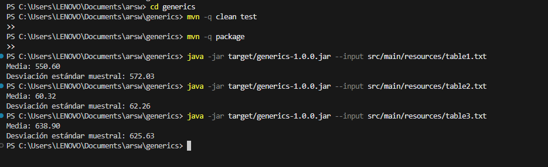

# Generics 

## David Santiago Castro Sierra

Aplicación de línea de comandos que lee números reales desde un archivo, los almacena en una lista enlazada genérica propia compatible con la API de Collections, y calcula media y desviación estándar  (denominador n-1).  
Incluye JUnit 5, Javadoc.

## 1) Descripción del problema

Dado un archivo de texto con n números reales, se requiere:

- Leer los datos.
- Almacenarlos en una lista enlazada genérica propia (no java.util.LinkedList) que implemente java.util.List<E> e Iterator<E>.
- Calcular:
  - Media  
    \[
    \text{mean} = \frac{\sum_{i=1}^{n} x_i}{n}
    \]
  - Desviación estándar (usa n-1)  
    \[
    s = \sqrt{\frac{\sum_{i=1}^{n}(x_i - \text{mean})^2}{n - 1}}
    \]
- Probar con datasets de ejemplo y validar resultados esperados (tolerancia ±0.01).

Formato de entrada:
- Reales separados por espacios y/o comas.
- Líneas en blanco permitidas.
- Comentarios a partir de "#".
- Parsing con Locale.ROOT (punto decimal ".").

## 2) ¿Cómo se abordó el problema? 

1. Separación de responsabilidades
   - App solo parsea argumentos, delega la lectura a DoubleFileReader, y el cálculo a Stats.
   - DoubleFileReader se enfoca en E/S robusta (comentarios, líneas en blanco, múltiples separadores).
   - Stats contiene cálculo puro (media y desviación) con validaciones.
   - SimpleLinkedList<E> implementa la estructura de datos cumpliendo contratos de List<E>.

2. Estructura de datos propia
   - Lista doblemente enlazada con Node<E>{prev,next,item}para O(1) amortizado en add(E) al final.
   - Índices con coste O(n) (búsqueda desde cabeza o cola según convenga).
   - Iterador fail-fast usando modCount para detectar modificaciones concurrentes externas.

3. Robustez y contrato de API
   - Lanzamos IndexOutOfBoundsException en índices inválidos.
   - Validaciones en Stats (data no nula/ vacía; "n>=2" para desviación).
   - UnsupportedOperationException solo en métodos no implementados (listIterator, subList).

4. Diseño para pruebas
   - Datasets de ejemplo en src/main/resources/.
   - Pruebas unitarias verifican valores esperados (±0.01), recorrido del iterador, excepciones e iterador fail-fast.

## 3) ¿Cuál es la solución y qué se usó?

### Tecnologías y configuración
- Java 21
- Maven:
  - maven-compiler-plugin (release=21)
  - maven-surefire-plugin para JUnit 5
  - maven-jar-plugin con Main-Class para crear JAR ejecutable
- Javadoc con mvn javadoc:javadoc

### Paquetes y responsabilidades
edu.eci.arsw.generics
├─ App implica que CLI: parsea --input, lee archivo y muestra mean y s (n-1)
├─ io
│ └─ DoubleFileReader implica que Lee archivo (comentarios, comas/espacios) y retorna SimpleLinkedList<Double>
├─ math
│ └─ Stats implica mean(List<Double>), sampleStdDev(List<Double>) con validaciones
└─ collections
└─ SimpleLinkedList es una Lista doblemente enlazada genérica (propia) que implementa List<E> e Iterator<E> (fail-fast)

### Uso de genéricos
- SimpleLinkedList<E> y Node<E> permiten reutilizar la estructura para cualquier tipo
- DoubleFileReader.read retorna List<Double> (concretamente SimpleLinkedList<Double>), lo que demuestra polimorfismo frente a la interfaz List<E>
- Métodos add, get, set, remove, etc., manipulan "E" de forma segura en tiempo de compilación

### Uso de lambdas
- En pruebas (JUnit 5) se emplean lambdas con assertThrows(() -> ...), aprovechando interfaces funcionales (Executable).
- La colección implementa Iterable<E>, por lo que es compatible con APIs funcionales. Ejemplos posibles:
  
  java:
  // Ejemplo alternativo (no requerido por la app principal):
  var data = new SimpleLinkedList<Double>();
  data.add(10.0); data.add(20.0);
  final double[] acc = {0.0};
  data.forEach(x -> acc[0] += x); // lambda sobre Iterable

## 4) Arquitectura y diseño (detalles)
- Invariantes de SimpleLinkedList:
  - size >= 0
  - Lista vacía ⇒ head == null && tail == null
  - Lista no vacía ⇒ head.prev == null && tail.next == null
  - Enlaces prev/next coherentes en toda la cadena.

 - Contratos de Collections:
  - add(e) añade al final (O(1) amort.).
  - add(i,e), get(i), set(i,e), remove(i) validan índices
  - iterator() es fail-fast: si hay cambios estructurales externos, lanza ConcurrentModificationException.
## 5) Cómo compilar, probar, empaquetar y ejecutar

### Requisitos: Maven 3.9+ y JDK 21

#### 0) cd generics

#### 1) Compilar + ejecutar pruebas
mvn -q clean test

#### 2) Empaquetar JAR ejecutable
mvn -q package

#### 3) Ejecutar (ejemplo con dataset incluido)
java -jar target/generics-1.0.0.jar --input src/main/resources/table1.txt

## 6) Salida esperada de ejemplo:
Media: 550.60
Desviación estándar muestral: 572.03

Parámetros CLI:
  - --input <ruta> : obligatorio. Ruta a un archivo de texto con los datos.

  - Si falta --input, la app imprime ayuda y sale con código 1.

  - Errores de E/S o formato ⇒ mensaje claro en stderr y código 2.

### 7) Formato de entrada: ejemplos
Archivo válido:

- Comentarios con "#"
15.0, 69.9, 6.5

22.4 28.4, 65.9
19.4, 198.7, 38.8, 138.2  # Comentario al final

### 8) Pruebas (JUnit 5)

- Datasets:

  - src/main/resources/table1.txt
  - src/main/resources/table2.txt
  - src/main/resources/table3.txt

- Valores esperados:
  - Columna 1: media 550.60, desviación estandar 572.03
  - Columna 2: media 60.32, desviación estandar 62.26
  - Columna 3: media 638.90, desviación estandar 625.63

- Tolerancia: ±0.01.

